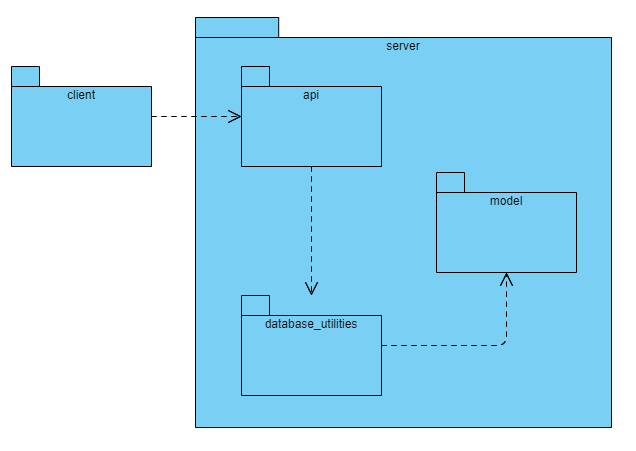
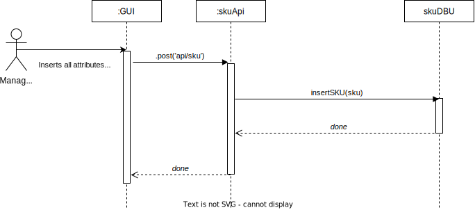
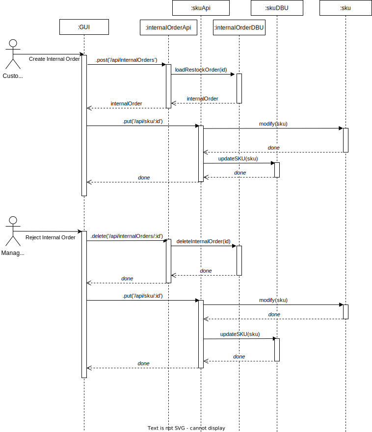

# Design Document 

Authors: Ilaria Pilo, Marco Sacchet, Luca Scibetta, Enes Yarali

Date: 25 May 2022

Version: 1.8

# Contents

- [High level design](#package-diagram)
- [Low level design](#model)
- [Verification traceability matrix](#verification-traceability-matrix)
- [Verification sequence diagrams](#verification-sequence-diagrams)

# High level design 

For our design, we have adopted a layered, model-view architectural style.  
In particular, we have a front end (`client`), taking care of the presentational aspect, which interacts with a back end (`server`), managing the application logic and data.  
The back end is then further logically split into two parts, one taking care of the model and its logic, and another one which is used as an interface with the database. 

## Package diagram

## Front End
The front end, which contains the GUI, is externally provided.  
Hence, we will not focus on it.

## Back End
The back end is further divided into 3 different packages:
- `api`, containing apis used to handle interactions between front end and the database.
- `model`, containing all classes needed to manage and to represent data, included errors.
- `database_utilities`, containing functions to interact with the db. 

# Low level design

## Model

Apart from the listed methods, all classes have:
- one / many personalized constructors to initialize (part of) its attributes and, when needed, directly performing some consistency checks. 
- getters and setters for some attributes when needed. 

which have been omitted for the sake of brevity.  

Notice that all classes in `model` have few to none methods, except for `SKU`, that is more complex.
This is a direct consequence of the fact that every change made on an Sku, has to be propagated in the rest of the system in order to keep consistency.
`Error` class define an object used to propagate errors betweeen `database_utilities` functions and APIs.

On the other hand, classes in `api` and `database_utilities` are, as expected, longer, due to the fact that every action of the application is handled by these.

### Api
The `api` interface is used by the front end to interact with the back end.  
Its roles are:
1. Checking *correctness* of the parameters received from the front end
2. Interact with the database by calling the proper low-level functions
3. Respond to the front end's request with the data provided by `database_utilities` classes.
4. Convert potential errors in corresponding HTTP codes.

### Database Utilities
The `database_utilities` interface is used by the APIs to interact with the database.
Its roles are:
1. Checking *consistency* of the parameters received from the front-end
2. Interact with the database by executing the proper SQL-queries
3. Respond to API calls with the data provided by the database.
4. Convert potential database's errors in API manageable errors.
------------------------------------------------------------
## Model 
**SKU**  
`void modify(openDB, newDescription, newWeight, newVolume, newNotes, newPrice, newAvailableQuantity)`
Apply modification at an object of type `SKU` and propagate it with propapagatePosition.

`void #propagatePosition(openDB, position, occupiedWeight=0, occupiedVolume=0)`
Propagate the changes of Sku to the database, in order to mantain consistency.

## Api
**skuApi**  
`.get('/api/skus')`  
Returns a list of all the SKUs in the database, by calling db.loadSKU(null).

`.get('/api/skus/:id')`  
Return a single SKU identified by its Id, by calling db.loadSKU(skuId).

`.post('/api/sku')`  
Create a new SKU by calling db.insertSKU() with the parameters fetched from the request's body.

`.put('/api/sku/:id')`
Fetches the SKU from the database by calling db.loadSKU(skuId), then calls sku.modify(...). Finally, if no exceptions have been raised, the changes are made persistent by calling db.updateSKU(sku).

`.put('/api/sku/:id/position')`  
Fetches the SKU from the database by calling db.loadSKU(skuId), then calls sku.setPosition(p). Finally, if no exceptions have been raised, the changes are made persistent by calling db.updateSKU(sku) and db.updatePosition(p).

`.delete('/api/skus/:id')`  
Fetches the SKU from the database by calling db.loadSKU(skuId), then delete it by calling db.deleteSKU(sku)

**SkuitemApi**  
`.get('/api/skuitems')`  
Returns a list of all the SKUitems in the database, by calling db.loadSKUitem(null).

`.get('/api/skuitems/sku/:id)`  
Searches in the database all SKUitems whose skuId matches the one in input, by calling db.loadSKUitem(skuId).
Returns the requested SKUitems.

`.get('/api/skuitems/sku/:rfid)`  
Searches in the database the SKUitem whose rfid matches the one in input, by calling db.loadSKUitem(rfid).
Returns the requested SKUitem.

`.post('/api/skuitem')`
Create a new SKUitem by calling db.insertSKUitem() with the parameters fetched from the request's body.

`.put('/api/skuitems/:rfid')`  
The changes are propagated by calling db.updateSKUitem(skuItem).

`.delete('/api/skuitems/:rfid')`  
Delete it by calling db.deleteSKUitem(rfid).

**positionApi**  
`.get('/api/positions')`
Returns a list of all the positions in the database, by calling db.loadPosition(null).

`.post('/api/position')`  
Create a new Position by calling db.insertPosition() with the parameters fetched from the request's body.

`.put('/api/position/:positionID')`  
Check if the positionID is valid.
The changes are propagated by calling db.updatePosition(...).

`.put('/api/position/:positionI/changeID')`  
Check if the positionID is valid.
The changes are propagated by calling db.updatePosition(...).

`.delete('/api/position/:positionID')`  
Check if the positionID is valid.
Delete it by calling db.deletePosition(positionID).

**testDescriptorApi**  
`.get('/api/testDescriptors')`  
Returns a list of all the test descriptors in the database, by calling db.loadTestDescriptor(null).

`.get('/api/testDescriptors/:id')`  
Check if the id is valid.
Searches in the database the test descriptor whose id matches the one in input, by calling db.loadTestDescriptor(testId).
Returns the requested TestDescriptor.

`.post('/api/testDescriptors')`  
Create a new TestDescriptor by calling db.insertTestDescriptor() with the parameters fetched from the request's body.

`.put('/api/testDescriptors/:id')`  
Fetches from the database the test descriptor which id match the one in input by calling test = db.loadTestDescriptor(testId). Then the changes are made persistent by calling db.updateTestDescriptor(test).

`.delete('/api/testDescriptors/:id')`  
Check if the testId is valid.
Delete it by calling db.deleteTestDescriptor(testId).

**testResultApi**  
`.get('/api/skuitems/:rfid/testResults')`  
Returns a list of all the test results in the database correspondent to a SKUitem whose rfid matches the one in input, by calling db.loadTestResult(rfid).

`.get('/api/skuitems/:rfid/testResults/:id')`  
Searches in the database the test result whose pair (rfid, id) matches the one in input, by calling db.loadTestResult(rfid, resultId).
Returns the requested TestResult.

`.post('/api/skuitems/testResults')`  
Create a new TestResult by calling db.insertTestResult() with the parameters fetched from the request's body.

`.put('/api/skuitems/:rfid/testResults/:id')`  
Check if rfid and testId are valid. Then the changes are made persistent by calling db.updateTestResult(...).

`.delete('/api/skuitems/:rfid/testResults/:id')`  
Check if rfid and testId are valid.
Delete it by calling db.deleteTestResult(rfid,testId).

**userApi**  
`.get('/api/suppliers')`  
Returns a list of all the suppliers in the database by calling db.loadUser(null, 'aupplier').

`.get('/api/users')`  
Returns a list of all the users in the database by calling db.loadUser().

`.post('/api/newUser')`  
Create a new User by calling db.insertUser() with the parameters fetched from the request's body.

`.post('/api/managerSessions')`  
`.post('/api/customerSessions')`  
`.post('/api/supplierSessions')`  
`.post('/api/clerkSessions')`  
`.post('/api/qualityEmployeeSessions')`  
`.post('/api/deliveryEmployeeSessions')`  
Check if username and password are correct calling db.checkPassword(username, type of user, password).

`.put('/api/users/:username')`  
Fetches from the the database usr = db.loadUser(username, oldType), then calls usr.setType(newType). The changes are made persistent by calling db.updateUser(usr).

`.delete('/api/users/:username/:type')`  
Calls db.deleteUser(username, type). If type = administrator an error is raised.

**restockOrderApi**  
`.get('/api/restockOrders')`  
Returns a list of all the restock orders in the database by calling db.loadRestockOrder().

`.get('/api/restockOrdersIssued')`  
Returns a list of all the restock orders in the database in the ISSUED state by calling db.loadRestockOrder(null,'ISSUED').

`.get('/api/restockOrders/:id')`  
Searches in the database the restock order whose id matches the one in input, by calling db.loadRestockOrder(orderId).
Returns the requested RestockOrder.

`.get('/api/restockOrders/:id/returnItems')`  
Calls db.selectReturnItems(orderId). This function is done at a lower level to avoid many unnecessary loads from the database.

`.post('/api/restockOrder')`
Create a new Restock Order by calling db.insertRestockOrder() with the parameters fetched from the request's body.

`.put('/api/restockOrder/:id')`  
Calls db.patchRestockOrderState(id, state) to update the state of restock order with matching id with the state provided through request.body.

`.put('/api/restockOrder/:id/skuItems')`  
Calls db.patchRestockOrderSkuItems(orderId, skuItems) to add the provided sku items to a restock order.

`.put('/api/restockOrder/:id/transportNote')`
Calls db.patchRestockOrderTransportNote(orderId, transportNote) to add a trasport note to an order in "DELIVERY" state.

`.delete('/api/restockOrder/:id')` 
Calls db.deleteRestockOrder(orderId) to delete the order with matching id.

**ReturnOrder**
`.get('/api/returnOrders)`
Calls db.loadReturnOrder() to retrieve all return orders in the database.

`.get('/api/returnOrders/:id')`
Calls db.loadReturnOrder(orderId) to retrieve the specified return order.

`.post('/api/returnOrder')`
Add a new return order in the database with data specified in the request body by calling db.insertReturnOrder(returnDate, products, restockOrderId).

`.delete('/api/returnOrder/:id')`
Delete from the databse the return order with specified id (in request) by calling deleteReturnOrder(orderId).

**InternalOrder**
`.get('/api/internalOrders')`
Retrieve all internal orders in the database by calling db.loadInternalOrder().

`.get('/api/internalOrdersIssued')`
`.get('/api/internalOrdersAccepted')`
Retrive all internal orders in the database with state matching the one in the url (the desired state is defined inside the API function since it is not passed through request headers or body) by calling db.loadInternalOrder(null, state).

`.get('/api/internalOrders/:id')`
Retrieve the internal order with matching id by calling db.loadInternalOrder(orderId).

`.post('/api/internalOrders')`
Add a new internal order in the database with data passed through request body by calling db.insertInternalOrder(issueDate, products, customerId).

`.put('/api/internalOrders/:id')`
Update the state of an internal order with matching id by calling db.updateInternalOrder(orderId, newState, products) with data of request body.

`.delete('/api/internalOrders/:id')`
Delete from the database the internal order with matching id by calling db.deleteInternalOrder(orderId).

**Item**
`.get('/api/items')`
Retrieve all items in the database by calling db.loadItem().

`.get('/api/items/:id/:supplierId')`
Retrieve the item with matching id from the database by calling db.loadItem(id).

`.post('/api/item')`
Add a new item with data from request body in the database by calling db.insertItem(id, description, price, SKUId, supplierId).

`.put('/api/item/:id/:supplierId')`
Update an existing item (with matching id) with a new description and a new price by calling db.updateItem(id, newDescription, newPrice) with data of request headers and body.

`.delete('/api/items/:id/:supplierId')`
Delete the item with matching id from the database by calling db.deleteItem(itemId).

## Database utilities

This classes will be used as interfaces towards the database storing information needed by the application. All functions are generally simple and low-level, except for few cases.
Given the possibility to modify SKUitem RFID, a fixed Id is provided to maintain database's internal consistency.  
For delete functions, additional parameters are provided to delete entries according to object they reference, to be used for maintaining consistency. However, since such behaviours have not been specified in the official requirements, they will not be explicitly used in the design.

**skuDBU**
`  Array<SKU> loadSKU (skuId :Integer=null)`  
Select all SKU with the given skuId. If no skuId is provided, it returns all skus in the database.
For every SKU selected, all testDescriptor ids with matching skuId are returned.

`  void insertSKU (sku :SKU)`  
Insert a new SKU in the database.

`  void updateSKU (sku :SKU)`  
Update information of an existing SKU in the database.

`  void deleteSKU (skuId :Integer)`  
Delete from the database the SKU with matching skuId.

`  Boolean searchAssignedPosition (positionId :Integer)`
Checks if the requested position is occupied.

**skuItemDBU**
`  Array<SKUitem> loadSKUitem (rfid :String=null, skuId :Integer=null)`  
Select all SKUitem with the given skuId and rfId. If no id is provided, it returns all SKUitems in the database with Available equals to true.

`  void insertSKUitem (skuitem :SKUitem)`  
Insert a new SKUitem in the database with Available equals to false.

`  void updateSKUitem (oldRfId :String, skuItem :SKUitem)`  
Update information of an existing SKUitem in the database.

`  void deleteSKUitem (rfId :String=null, skuId :Integer=null)`  
Delete from the database the SKUitem with matching skuId.
Delete from the database the SKUitem with matching rfId. 
Notice we don't have a literal deletion since, to keep the order history clear, SKUitems are never deleted: their isAvailable flag is simply put to false (meaning this function is actually an update).

**positionDBU**
`  Array<Position> loadPosition(positionId :String=null, skuId :Integer=null)`  
Select the Position with the given positionId.
Select the Position storing the SKU with the given skuId.
If no positionId / skuId is provided, it returns all Positions in the database.

`  void insertPosition (position :Position)`  
Insert a new Position in the database.

`  void updatePosition (oldPositionId :String, position :Position)`  
Update information of an existing Position in the database.

`  void deletePosition (positionId :String)`  
Delete from the database the Position with matching PositionId.

**testDescriptorDBU**
`  Array<TestDescriptor> loadTestDescriptor (testId :Integer=null)`  
Select all TestDescriptor with the given testId. If no testId is provided, it returns all TestDescriptor in the database.

`  void insertTestDescriptor (testDescriptor :TestDescriptor)`  
Insert a new TestDescriptor in the database.

`  void updateTestDescriptor (testDescriptor :TestDescriptor)`  
Update information of an existing TestDescriptor in the database.

`  void deleteTestDescriptor (testId :Integer=null, skuid :Integer=null)`  
Delete from the database the TestDescriptor with matching skuId.
Delete from the database the TestDescriptor with matching testId.

**testResultDBU**
`  Array<TestResult> loadTestResult (rfid :String, resultId :Integer=null)`  
Select all TestResult with the given rfid and resultId. If no resultId is provided, it returns all TestResult with the given rfid.

`  void insertTestResult (testresult :TestResult)`  
Insert a new TestResult in the database.

`  void updateTestResult (testresult :TestResult)`  
Update information of an existing TestResult in the database.

`  void deleteTestResult (rfId :String=null, resultId :Integer=null,testId :Integer=null)`  
Delete from the database the TestResult with matching rfId.
Delete from the database the TestResult with matching resultId.
Delete from the database the TestResult with matching testId.

**userDBU**
`  Array<User> loadUser (username :String=null, type :Role=null, userId :Integer=null)`  
Select all User with the given username, type and userId. If one or more parameters are missing, it returns all Users in the database matching parameters provided. If all parameters are missing, it returns all the Users in the database excluding Managers.

`  void insertUser (user :User)`  
Insert a new User in the database.

`  void updateUser (oldType :Role, user :User)`  
Update information of an existing User in the database.

`  void deleteUser (username :String, type :Role)`  
Delete from the database the User with matching username and type.

`  User checkPassword (username :String, type :Role, password: String)`
Checks if the user credentials are correct and if so return the user info.

**restockOrderDBU**
`  Array<RestockOrder> loadRestockOrder (orderId :Interger=null, state :RestockOrderdState=null)`  
Select all RestockOrder with the given orderId and state.. If no orderId is provided, it returns all RestockOrders in the database with a matching state. If no state is provided, it returns all RestockOrders in the database with a matching orderId.  If all parameters are missing, it returns all the RestockOrders in the database.

`  void insertRestockOrder (restockorder :RestockOrder)`  
Insert a new RestockOrder in the database.

`  void patchRestockOrderState (orderId :Integer, newState :String)`  
Update the state of a RestockOrder in the database.

`  void patchRestockOrderSkuItems (orderId :Integer, skuItems :Array<SKUitem>)`  
Add passed sku items to the specified restock order.

`  void patchRestockOrderTransportNote (orderId :Integer, newTransportNote :String)`  
Update transport note of a restock order.

`  void deleteRestockOrder (orderId :Integer)`  
Delete from the database the RestockOrder with matching orderId.

`  Array<SKUitem> selectReturnItems (orderId :Integer)`
Return the list of all sku items that have not passed no one of the tests. 

`  String retriveState (orderId :Integer)`
Return the state of the requeste restock order.

**returnOrderDBU**
`  Array<ReturnOrder> loadReturnOrder (orderId :Integer=null)`  
Select all ReturnOrder with the given orderId. If no orderdId is provided, it returns all ReturnOrders in the database.

`  void insertReturnOrder (returnorder :ReturnOrder)`  
Insert a new ReturnOrder in the database.

`  void deleteReturnOrder (orderId :Integer)`  
Delete from the database the ReturnOrder with matching orderId.

**internalOrderDBU**
`  Array<InternalOrder> loadInternalOrder (orderId :Integer=null, state :InternalOrderState=null) `  
Select all InternalOrder with the given orderId. If no orderdId is provided, it returns all internalOrders in the database with a matching state. If no state is provided, it returns all InternalOrder in the database with a matching orderId. If all paramters are missing, it returns all the InternalOrders in the database.

`  void insertInternalOrder (internalOrder :InternalOrder)`  
Insert a new InternalOrder in the database.

`  void updateInternalOrder (internalOrder :InternalOrder)`  
Update information of an existing InternalOrder in the database.

`  void deleteInternalOrder (orderId :Integer)`  
Delete from the database the InternalOrder with matching orderId.

**itemDBU**
`  Array<Item> loadItem (itemId :Itenger=null, supplierId :Integer=null)`  
Select all Item with the given itemId. If no itemId is provided, it returns all Items in the database.

`  void insertItem (item :Item)`  
Insert a new Item in the database.

`  void updateItem (itemId :Itenger, descriptor :String, price : Float, supplierId :Integer)`  
Update information of an existing Item in the database.

`  void deleteItem (itemId :Integer=null, supplierId :Integer=null, skuId :Integer=null)`  
Delete from the database the Item with matching itemId.
Delete from the database the Item with matching supplierId.
Delete from the database the Item with matching skuId.

# Verification traceability matrix

| | User/API/DBU | SKU/API/DBU | SKUitem/API/DBU | Item/API/DBU | Position/API/DBU | TestDescriptor/API/DBU | TestResult/API/DBU | RestockOrder/API/DBU | ReturnOrder/API/DBU | InternalOrder/API/DBU |
| ------------- |:-------------|:-----|:-----|:-----|:-----|:-----|:-----|:-----|:-----|:-----|
| FR1  | X | | | | | | | | | |
| FR2  | | X | | | X | | | | | |
| FR3  | | | | | X | X | X | | | |
| FR4  | X | | | | | | | | | |
| FR5  | | X | X | | X | | | X | X | X |
| FR6  | | X | X | | X | | | | | X |
| FR7  | | X | | X | | | | | | |

# Verification sequence diagrams
For our sequence diagrams, we have focused on different scenarios, to show various functionalities of our application.

## Scenario 1-1, create SKU

## Scenario 1-3, modify SKU weight and volume
We are assuming that the SKU is already associated to a position, hence the system should also automatically updates the occupied weight and volume of such position.

## Scenario 5-2-1, record positive test results of all SKU items of a RestockOrder

## Scenario 6-1, return order of SKUitems which did not pass any quality test

## Scenario 9-2, internal order refused

## Scenario 12-3, delete test descriptor
