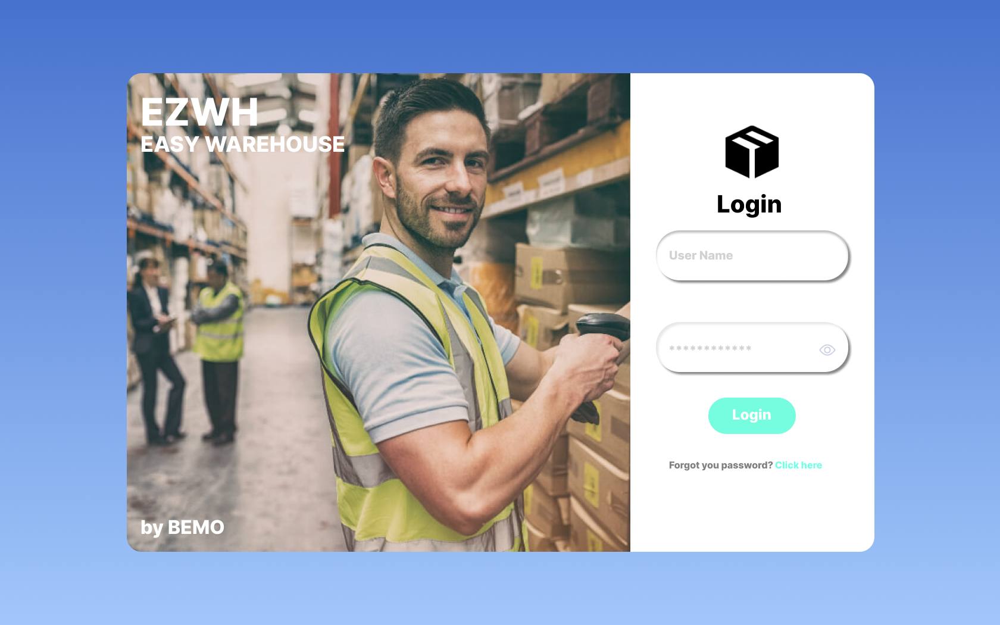
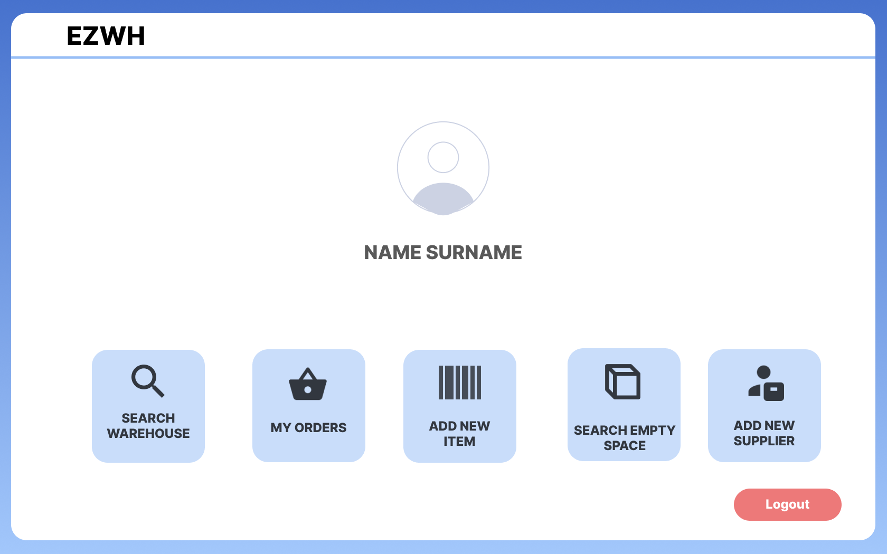
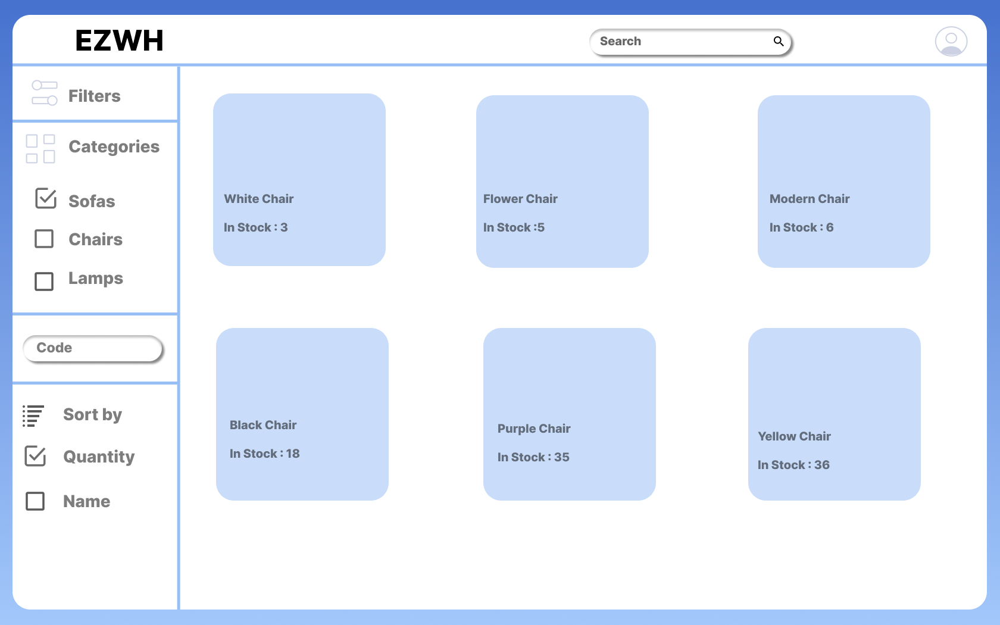
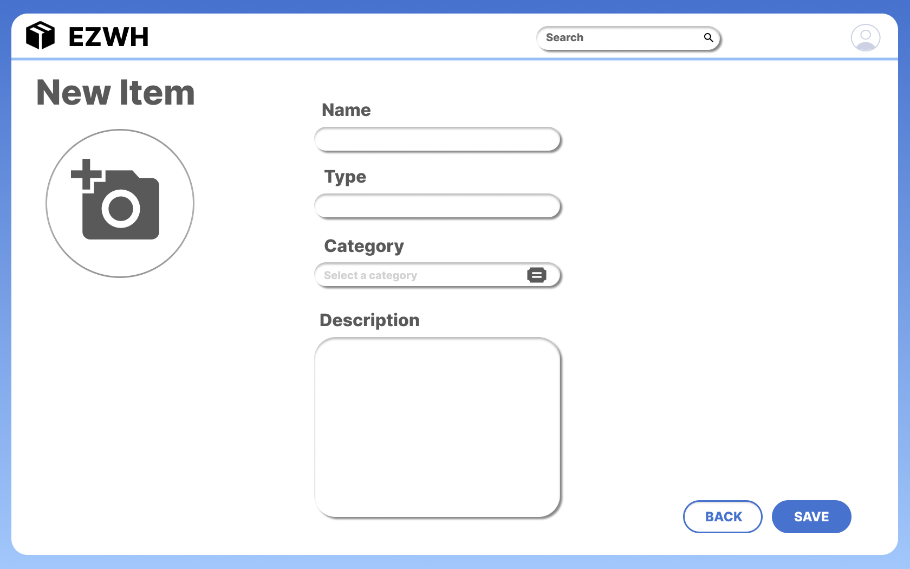
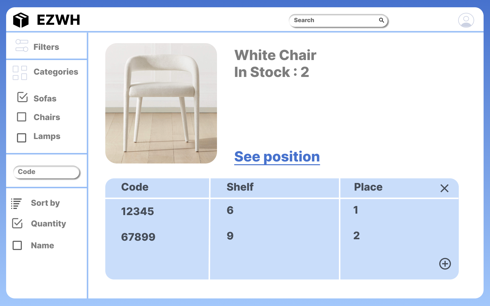
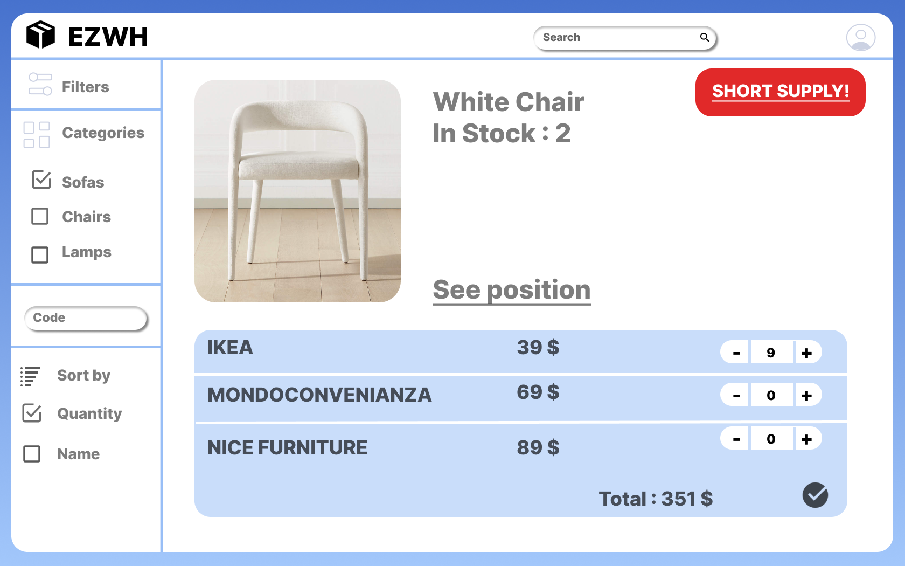
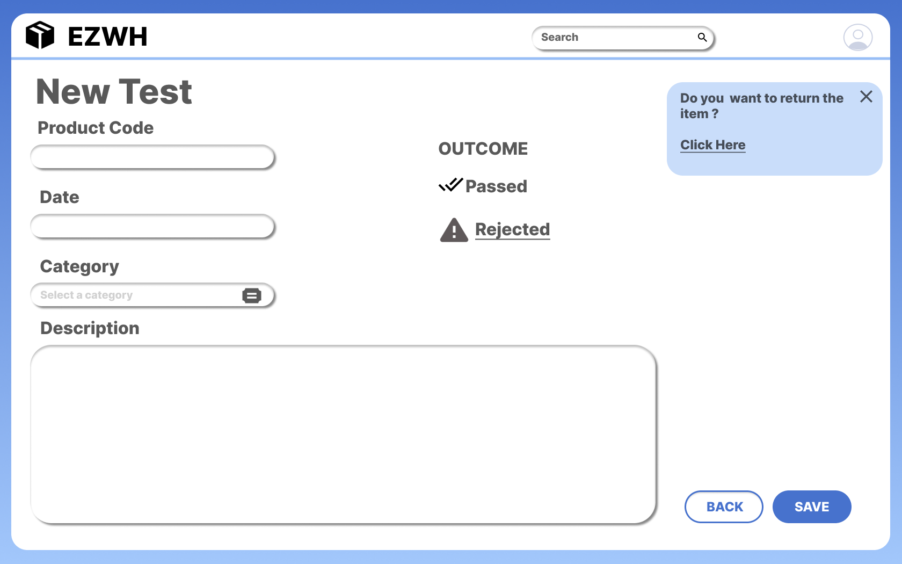
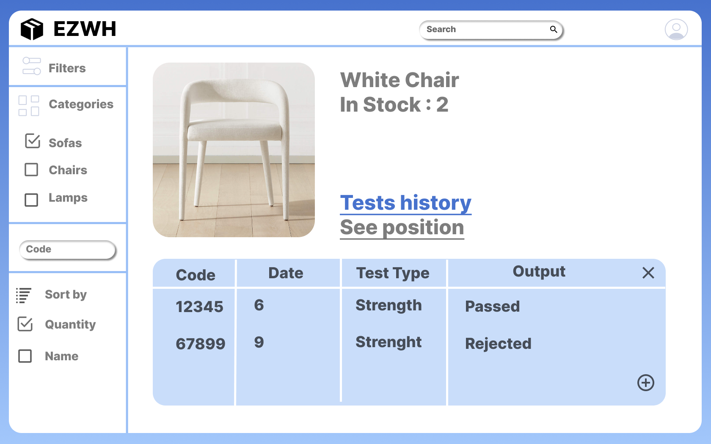
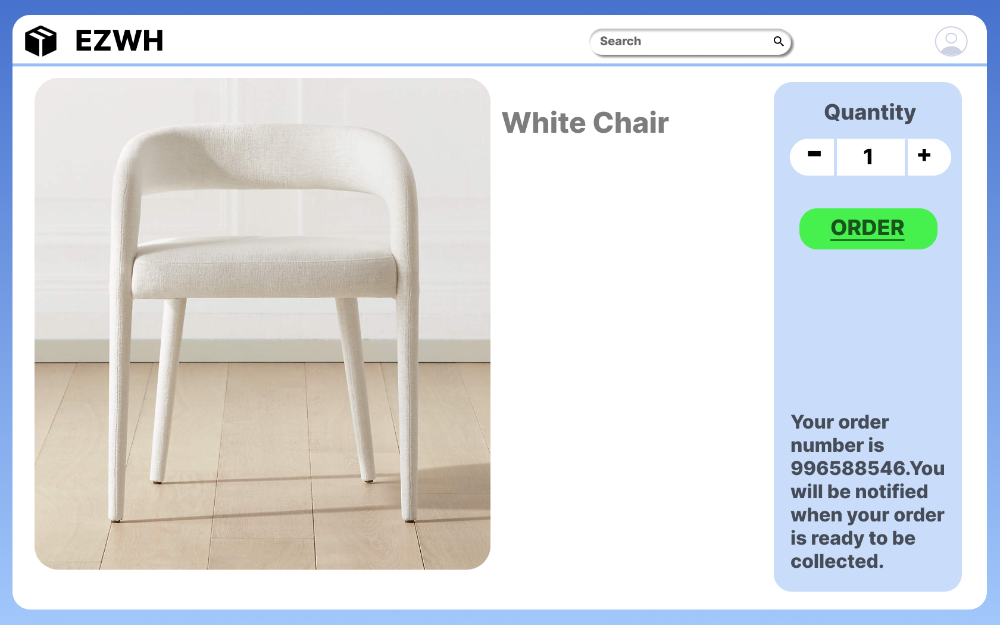

# Graphical User Interface Prototype  

Authors: Ilaria Pilo, Marco Sacchet, Luca Scibetta, Enes Yarali

Date: 08 April 2022

Version: 1.0

For our prototype, we imagined the usage of EzWh in a medium size company designing and building movie and theatre sets (for this reason, the warehouse mainly stores furniture).

## Login page

All employees can log in from the same, common page. The application then loads and makes available different functionalities according to the privilege of the employee.

## Home page

The home page provides a quick and intuitive access to all functionalities for a given profile.  
In this example, we are showing the home page of a Warehouse Manager.

## Searching the warehouse

Searching the catalogue of the warehouse is the basic functionality of the application, to which all users have access.
A handy sidebar provides different types of filters, to ensure each employee can find the fittest item descriptor in the shortest time.  

")

All pages are characterized by the same navigation bar. A user button on the right side shows a quick-access profile menu.

## Orders history

Both Warehouse Manager (for external orders) and Unit Supervisor (for internal orders) have access to an apposite page providing an overview on the orders history. They can then click on the single order to inspect its details. All orders whose status is *In progress* have also a trash icon button, to be used for fast deletion.  
In this example, we are showing the orders history of a Warehouse Manager.

## Adding a new item

Whenever a new item descriptor is added to the catalogue, the Warehouse Manager needs to manually insert it in the application database. However, thanks to the provided form, such task becomes easy and intuitive.  
A dual approach is used to handle the insertion of a new supplier.

## Tracking positions

After selecting a given item descriptor, all users having Warehouse Worker's privileges can click on the *See position* label to retrieve the physical position of all items inside the warehouse.  
They can also add new positions by clicking on the proper button.

## Short supply and external orders

Whenever the Warehouse Manager receives a notification for a short supply, he/she can click on it to be conveniently redirected to the external order page. The same page can be manually reached by querying the catalogue in the proper search bar with the item name, and then clicking on the *Short supply!* danger button.  
The page shows a list of supplier for the item, sorted by increasing price. It is also possible to order from many different suppliers in one shot.

## Quality tests management

All users having Quality Officer's privileges have access to additional functionalities to support tests management.  

Through their home page, Quality Officers can open a form to easily record information about a given test.  
Whenever the result of the test is marked as *Rejected*, a pop-up is shown, leading to some pre-compiled documents to support the rejection procedure.

Moreover, after selecting a given item descriptor, they can click on the *Tests history* label to quickly access all tests on that item descriptor.

## Internal orders

Unit Supervisors have limited access to warehouse information, hence they can simply query the catalogue and place internal orders. Internal and *physical* information is hidden to them.
